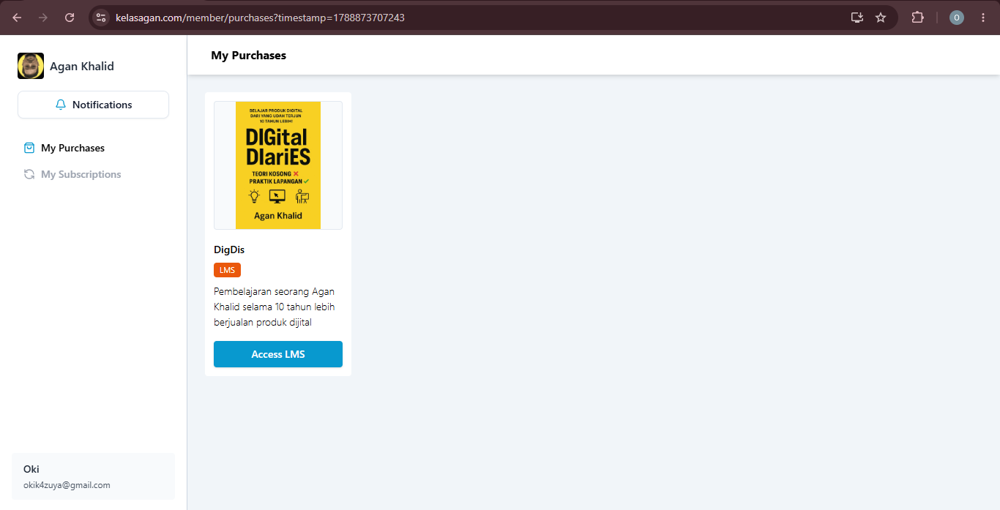

# Introductiona

Welcome to the example course. This chapter exists to exercise the content
pipeline end to end: front matter parsing, Markdown-to-HTML rendering, and a
relative-path image reference.

